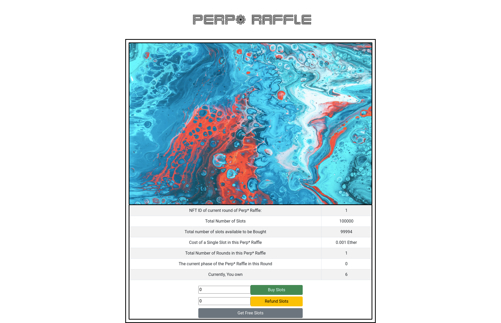
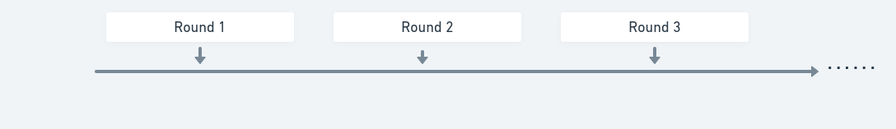
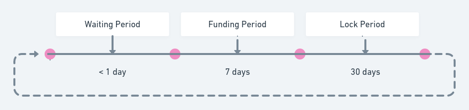

<div id="top"></div>

<!-- PROJECT LOGO -->
<br />
<div align="center">
  <a href="https://github.com/othneildrew/Best-README-Template">
    
  </a>

  <h3 align="center">PERP* RAFFLE</h3>

  <p align="center">
    A Non-Zero Sum Raffle
    <br />
    <br />
    <a href="https://youtu.be/8P3zttYnnFI">View Demo</a>
    ·
    <a href="https://github.com/merkle-groot/blockchain-developer-bootcamp-final-project/issues">Report Bug</a>
    ·
    <a href="https://github.com/merkle-groot/blockchain-developer-bootcamp-final-project/issues">Request Feature</a>
  </p>
</div>


<!-- TABLE OF CONTENTS -->
<details>
  <summary>Table of Contents</summary>
  <ol>
    <li>
      <a href="#about-the-project">About The Project</a>
      <ul>
        <li><a href="#built-with">Built With</a></li>
      </ul>
    </li>
    <li>
      <a href="#getting-started">Getting Started</a>
      <ul>
        <li><a href="#prerequisites">Prerequisites</a></li>
        <li><a href="#installation">Installation</a></li>
      </ul>
    </li>
    <li><a href="#usage">Usage</a></li>
    <li><a href="#roadmap">Roadmap</a></li>
    <li><a href="#contributing">Contributing</a></li>
    <li><a href="#license">License</a></li>
    <li><a href="#contact">Contact</a></li>
    <li><a href="#acknowledgments">Acknowledgments</a></li>
  </ol>
</details>


<!-- ABOUT THE PROJECT
## About The Project -->


## What is Perp* Raffle?
Perp* Raffle is an alternative take on NFT Raffle, which provides fair value to all the parties in the Raffle. People can get slots in the Raffle by just staking their ETH for a certain period of time which is a far cry from the traditional Raffles in which the Raffle operator makes away with huge payday without providing much value to the process. In Perp*, the operator's revenue source comes from lending the ETH provided by the people, which is returned to them fully or partially at the end of the staking period. 

## How does it work?
Instead of the Raffle being a one-off for a single NFT, there are multiple rounds i.e it is Perpetual! Each round has a single NFT with a single winner. And if the person stakes the ETH for more than one round, they are eligible for free slots in each subsequent round (compund interest? but for slots in the raffle).The free slots are not eligible for refunding/unstaking, the best part about these slots are that they can be carried on for further rounds even if they completely unstake their initial ETH. (win-win situation)




Each round is divided into phases:

* Waiting Period:
  * For the first round, this only involves sending an NFT to the Raffle contract which initializes all the parameters needed for its functioning.
  * In the next rounds, making a VRF coordinator call to Chainlink, waiting for the result and picking a winner is all part of this phase.
  * A winner is chosen based on the random string returned by Chainlink oracle and a new round is started by an NFT drop to the contract and the process continues...

* Funding Period:
  * This is the phase in which the users' can stake/unstake their ETH and get slots.
  * Reedeming of free slots takes place in this phase.

* Lock Period:
  * This is the part which is totally upto the Raffle operator to decide on. They can generate income by sending the staked funds to Lending platforms or any DeFi app that can give sufficient yield to offset the initial cost of setting up the Raffle.
  * The users' cannot stake/unstake their funds during this phase, they need to wait until the next funding phase.




Currently the timeframe for each phase is implemented as shown in the above diagram, with the exception being that waiting period depends on the delay introduced by the operator.

<p align="right">(<a href="#top">back to top</a>)</p>


### Built With

Perp* Raffle is made using open-source projects that you know and trust

* [React.js](https://reactjs.org/)
* [brownie](https://eth-brownie.readthedocs.io/en/stable/)
* [Hardhat](https://hardhat.org/)
* [Chainlink](https://chain.link/)
* [Web3JS](https://web3js.readthedocs.io/en/v1.5.2/)
* [Bootstrap](https://getbootstrap.com)


<p align="right">(<a href="#top">back to top</a>)</p>


<!-- GETTING STARTED -->
## Getting Started

To get a local copy up and running follow these simple example steps.

### Prerequisites
* brownie
  ```sh
  python3 -m pip install --user pipx
  python3 -m pipx ensurepath
  # restart your terminal
  pipx install eth-brownie
  ```

### Testing
1. Clone the repo
   ```sh
   git clone https://github.com/merkle-groot/blockchain-developer-bootcamp-final-project.git
   ```
3. Install dependencies
   ```sh
   cd blockchain-developer-bootcamp-final-project
   pip install -r requirements.txt
   ```
4. Get Ganache-gui/cli and run it it separately on port :8545

5. Run the tests
    ```sh
    brownie test
    ```
  
### Front-End
1. Navigate into the client folder
    ```sh
    cd client
    ```
2. Install all the required npm packages
    ```sh
    yarn install
    ```
3. Run the React Project
    ```sh
    yarn start
    ```

<p align="right">(<a href="#top">back to top</a>)</p>


<!-- USAGE EXAMPLES -->
## Usage
* The current deployed site is accessible from [this vercel deployment](https://blockchain-developer-bootcamp-final-project-o3kctl86i-bat-fleck.vercel.app/)
* Make sure to switch your network to Kovan Testnet in Metamask before interacting with the project!

<p align="right">(<a href="#top">back to top</a>)</p>

## Demo Video
[Youtube Link](https://youtu.be/8P3zttYnnFI)

<!-- ROADMAP -->
## Roadmap

- [x] Write Smart-Contracts
- [x] Test the code
- [x] Deploy it to Kovan
- [x] Add a front-end to interact with it
- [ ] Improve the UX/UI
- [ ] Write Treasury function for blue chip lending platforms

<p align="right">(<a href="#top">back to top</a>)</p>


<!-- CONTRIBUTING -->
## Contributing

Contributions are what make the open source community such an amazing place to learn, inspire, and create. Any contributions you make are **greatly appreciated**.

If you have a suggestion that would make this better, please fork the repo and create a pull request. You can also simply open an issue with the tag "enhancement".
Don't forget to give the project a star! Thanks again!

1. Fork the Project
2. Create your Feature Branch (`git checkout -b feature/AmazingFeature`)
3. Commit your Changes (`git commit -m 'Add some AmazingFeature'`)
4. Push to the Branch (`git push origin feature/AmazingFeature`)
5. Open a Pull Request

<p align="right">(<a href="#top">back to top</a>)</p>


<!-- LICENSE -->
## License

Distributed under the GNU GPL License. See `LICENSE.txt` for more information.

<p align="right">(<a href="#top">back to top</a>)</p>


<!-- CONTACT -->
## Contact
Vishnu Prakash - [@0x1379](https://twitter.com/0x1379) - visheh10@gmail.com
Ethereum Address - 0xFcC5C92C49730EA2de4911EFEc6a6B8Cec229575 

<p align="right">(<a href="#top">back to top</a>)</p>


<!-- ACKNOWLEDGMENTS -->
## Acknowledgments

Inspired by [Waffle Project](https://github.com/Anish-Agnihotri/waffle)

<p align="right">(<a href="#top">back to top</a>)</p>

